Hello everyone, how are you!? Myself Vishwajeet! but they call me Vish :)

<!--
**VishwajeetJha/VishwajeetJha** is a ✨ _special_ ✨ repository because its `README.md` (this file) appears on your GitHub profile.

Here are some ideas to get you started:

- 🔭 I’m currently working on ...
- 👯 I’m looking to collaborate on ...
- 🤔 I’m looking for help with ...
- 💬 Ask me about ...
- 📫 How to reach me: ...

-->

    <h3><code>vishftw@github ~ $ whoami</code></h3>
    <table>
        <tr>
            <td valign="top"></td>
            <!-- <td valign="top"></td> -->
        </tr>
    </table>
    <h3><code>vishftw@github ~ $ ./contributions.sh</code></h3>
    

- 🌱 I’m currently doing a Bachelor of Engineering in Computer Engineering!
- 😄 Pronouns: He/Him
- ⚡ Fun fact: Debugging is like being the detective in a crime movie where you are also the murderer. 🕵️‍♂️💻
